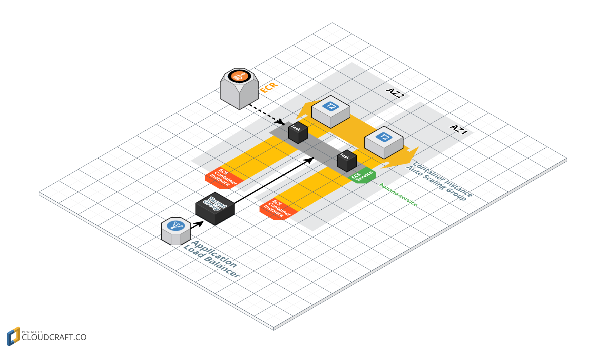

# Overview
This repository contains a lab for the mu workshop.  The goal of this lab is to run a simple spring boot microservice on ECS.




# Workspace setup

First, the following prerequisites should be installed on your machine:

* *aws-cli*: [Install](http://docs.aws.amazon.com/cli/latest/userguide/installing.html) and [configure](http://docs.aws.amazon.com/cli/latest/userguide/cli-chap-getting-started.html#cli-quick-configuration)
* *git*: Any git cli will do, however we will be using AWS CodeCommit for our source code.  In order to use https URLs, you'll need to configure git to use the AWS CLI for generating temporary credentials:

```
git config --global credential.helper '!aws codecommit credential-helper $@'
git config --global credential.UseHttpPath true
```
* *ssh*: Any ssh client will do.  You will need have a [key](https://help.github.com/articles/generating-a-new-ssh-key-and-adding-it-to-the-ssh-agent/) to explore the instances that mu creates.  The key needs to be imported into AWS via:

```
aws ec2 import-key-pair --key-name mu-key --public-key-material "$(cat ~/.ssh/id_rsa.pub)"
```

* *mu*: `curl -s http://getmu.io/install.sh | sh`


# Pull down banana service
Let's start by pulling down the sample spring boot microservice:

```
git clone git@github.com:cplee/mu-workshop-lab1.git banana-service
cd banana-service
```

Now, let's create a CodeCommit repo in our AWS account and push the service to the new CodeCommit repo.  If you are working a region other than *us-east-1*, then be sure to update the URL for the CodeCommit repo:

```
aws codecommit create-repository --repository-name banana-service
git remote set-url origin https://git-codecommit.us-east-1.amazonaws.com/v1/repos/banana-service
```

# Initialize mu.yml
We want to setup our `mu.yml` file so that mu can manage our service.  The easiest way to start is with `mu init`.  This doesn't actually do anything in your AWS account, just in your local mu.yml file.  Pass the `--env` flag to have mu also setup the environment for your service:

```
mu init --env
```

This generates 2 new files, `mu.yml` and `buildspec.yml`.  We need to make some updates to both to reflect run our microservice.

# Configure environments
Use the [Environments](https://github.com/stelligent/mu/wiki/Environments#configuration) section of the wiki to configure the following for your environments:

* ECS container instance type: Configure as *m4.large*
* EC2 keypair: Configure as *mu-key* that we imported earlier

# Configure service
Use the [Services](https://github.com/stelligent/mu/wiki/Services#configuration) section of the wiki to configure the following for your service:

* Path pattern: update to only route `/bananas/*`

# Configure pipeline
Use the [Pipelines](https://github.com/stelligent/mu/wiki/Pipelines#configuration) section of the wiki to configure the following for your service pipeline:

* Build image: Update the [image](http://docs.aws.amazon.com/codebuild/latest/userguide/build-env-ref.html#build-env-ref-available) that CodeBuild uses to `aws/codebuild/java:openjdk-8`

# Configure CodeBuild
Update the [buildspec.yml](http://docs.aws.amazon.com/codebuild/latest/userguide/build-spec-ref.html#build-spec-ref-syntax) to run `gradle build`.

# Push changes to CodeCommit
```
git add --all
git commit -m "mu init"
git push
```

# Create Pipeline
Now that our service is ready to deploy, let's create a pipeline for the service:

```
mu pipeline up
```
